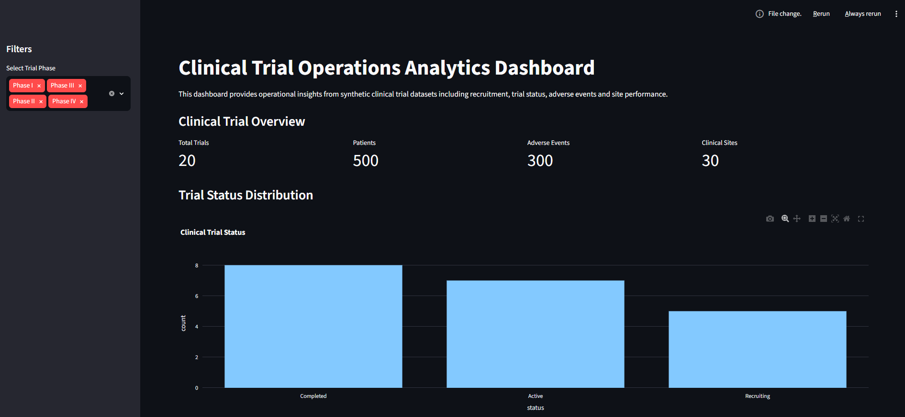

# 🧬 Clinical Trial Operations Analytics Platform

## 📸 Dashboard Preview




---

## 📌 Overview

**Clinical Trial Operations Analytics Platform** is a Python-based clinical informatics analytics project designed to demonstrate real-world workflows used in **clinical research operations and Clinical Research Organisations (CROs).**

The platform simulates clinical trial datasets and applies:

- 📊 Data engineering
- 🗄️ SQL database analytics
- 🔍 Data quality assessment
- 📈 Clinical operations dashboards
- 🤖 Machine learning-based risk prediction

The project identifies operational insights such as:

- Recruitment performance
- Site efficiency
- Trial progress monitoring
- Potential operational risks

This portfolio project demonstrates skills relevant to:

- Clinical Informatics Analyst
- Clinical Data Analyst
- Clinical Research Data Scientist
- Healthcare Data Scientist roles

---

# 🎯 Project Objectives

The main objectives are:

| Objective | Description |
|---|---|
| 🧪 Synthetic Data Generation | Create realistic clinical trial datasets |
| 🗄️ Database Development | Store trial data using SQLite relational database |
| 🔍 Data Quality Checks | Identify missing values and data inconsistencies |
| 📊 Analytics | Analyse recruitment and operational metrics |
| 📈 Dashboard | Develop interactive clinical trial dashboards |
| 🤖 Machine Learning | Predict potential trial operational risks |

---

# 🛠️ Technologies Used

## Programming

| Tool | Purpose |
|---|---|
| 🐍 Python 3.11 | Data processing and analytics |
| 🐼 Pandas | Data manipulation |
| 🔢 NumPy | Numerical analysis |

## Database

| Tool | Purpose |
|---|---|
| 🗄️ SQLite | Clinical trial database |
| SQL | Data querying and analysis |

## Visualisation

| Tool | Purpose |
|---|---|
| 📊 Streamlit | Interactive dashboard |
| 📈 Plotly | Interactive charts |
| 📉 Matplotlib | Data visualisation |

## Machine Learning

| Tool | Purpose |
|---|---|
| 🤖 Scikit-learn | Predictive modelling |

## Development Environment

| Tool | Purpose |
|---|---|
| 🟢 Conda | Environment management |
| 💻 VS Code | Development |
| 🐙 GitHub | Version control |

---

# 📂 Project Structure

```text
clinical-trial-operations-analytics/

│
├── data/
│   ├── clinical_trials.csv
│   ├── patients.csv
│   ├── adverse_events.csv
│   └── sites.csv
│
├── database/
│   └── clinical_trial.db
│
├── dashboard/
│   └── app.py
│
├── sql/
│   └── analysis_queries.sql
│
├── src/
│   ├── generate_data.py
│   ├── database_setup.py
│   ├── analytics.py
│   └── quality_checks.py
│
├── notebooks/
│
├── models/
│
├── requirements.txt
│
├── README.md
│
└── LICENSE
```

---

# 📊 Dashboard Features

The Streamlit dashboard provides:

✅ Clinical trial overview metrics  
✅ Recruitment monitoring  
✅ Site performance analysis  
✅ Adverse event summaries  
✅ Data quality indicators  
✅ Operational risk visualisation  


Example:

```
Clinical Trial Dashboard

Total Trials        20
Active Trials       12
Recruitment Rate    78%
High Risk Sites     3
```

---

# 🚀 Installation and Setup

Clone the repository:

```bash
git clone https://github.com/Suhirthakumar/clinical-trial-operations-analytics.git

cd clinical-trial-operations-analytics
```

Create Conda environment:

```bash
conda create -n clinical_ops python=3.11

conda activate clinical_ops
```

Install dependencies:

```bash
pip install -r requirements.txt
```

Run data generation:

```bash
python src/generate_data.py
```

Create database:

```bash
python src/database_setup.py
```

Run dashboard:

```bash
streamlit run dashboard/app.py
```

---

# 🧠 Future Development

Future improvements include:

- 🔮 Clinical trial delay prediction models
- 📍 Site performance forecasting
- 🧬 Integration with real-world clinical datasets
- ☁️ Cloud deployment using AWS/Azure
- ⚙️ ML pipeline automation using MLOps

---

# 👨‍🔬 Author

**Dr Suhirthakumar Puvanendran**

Bioinformatician | AI Researcher | Clinical Informatics Analyst | Lecturer

Research interests:

- Clinical Informatics
- Healthcare AI
- Biomedical Data Science
- Precision Medicine

---

⭐ If you find this project useful, please consider starring the repository.